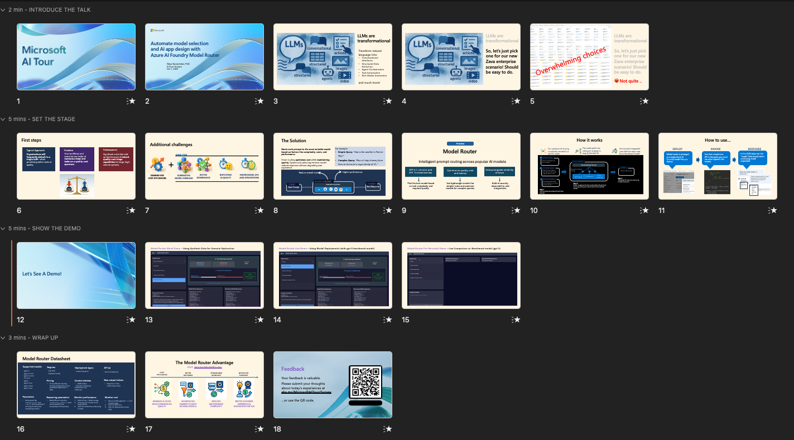
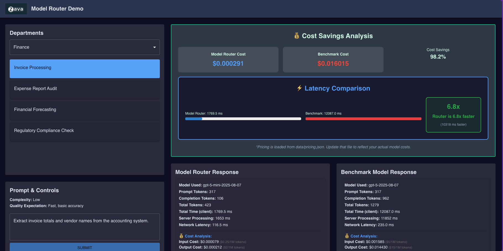

# How To Deliver This Session

Welcome to the Session Delivery Guidance section for LTG153. Thank you for delivering this 15-minute theater session on the Microsoft AI Tour. Prior to delivering this session:

1. Download the Presentaion from the [Files](#-files) section to your local device.
1. Fork this repository to your profile. You will use GitHub Codespaces for the demo.
1. Go through the [src/README.md](../src/README.md) guide to setup demo ahead of time.
1. Review the [Timing](#-timing) below to get a sense for how to pace the talk.

 

## 🕐 Timing

The figure below provides a high-level look at the slide-deck, organized into rows - each corresponding to 1 row of the timing table below.

| Time        | Description 
--------------|-------------
2 mins | Introduce yourself. Describe Model Selection Challenge.
5 mins | Introduce Model Router. Explain what it does - and how.
5 mins | Switch to the Demo. Show Model Router vs. Benchmark live.
3 mins | Wrap up. Reinforce Benefits. Share CTA for Feedback.
| | |

**Important:** 
- The demo can run in live (models) or mock (synthetic data) modes
- Prioritize live mode - unless you have challenges in setup or access
- If you have challenges with both demos - show the [recording](./assets/model-router-demo.mp4) instead.

 

## 📁 Files

Use the MP4 pre-recorded demo as a backup if your live demo does not work. The file has no audio - so you can embed it in your deck and talk through it interactively.

| Resources          | Links                            | Description |
|-------------------|----------------------------------|-------------------|
| Lighting Talk Slide Deck      |  [Presentation](https://aka.ms/AAxxqqe)  | Slide deck for the presentation |
| Demo Setup Guide | [README.md](../src/README.md) | Comprehensive guide to demo |
| Demo Recording | [Model Router Demo (MP4)](./assets/model-router-demo.mp4) | 1-min recording of live demo (no audio) |
| | |

 

## 🚀 Demo Quickstart

Start by completing these two steps in the Demo Guide.

1. [Setup AI Project with Model Deployments](./../src/README.md#21-model-deployments-live-demo) - deploy model-router and gpt-5.
1. [Launch GitHub Codespaces](./../src/README.md#31-using-github-codespaces-recommended) - complete these steps to launch applications.

You should now see a front-end UI you can interact with.
- Select a department 
- Submit a sample prompt
- Wait for the right side to refresh to compare execution
- Analyze how model-router perfoms w.r.t. benchmark model

