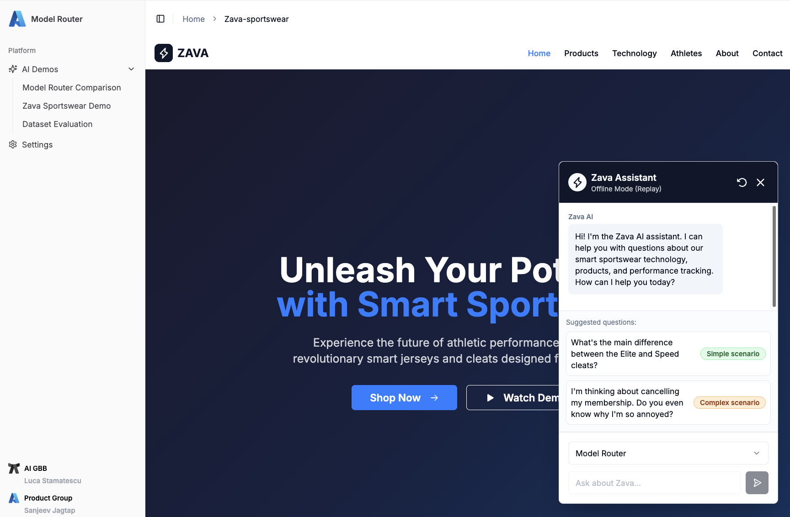
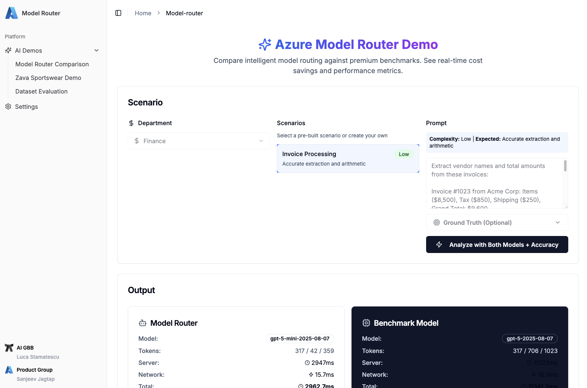
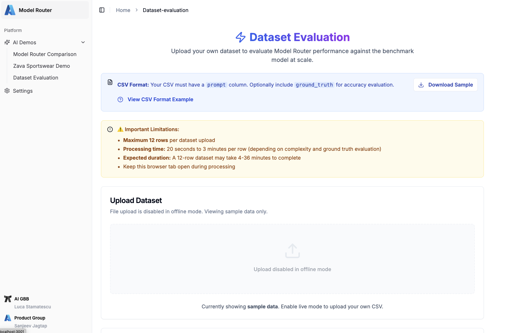

# How To Deliver This Session

Welcome to the Session Delivery Guidance section for LTG153. Thank you for delivering this 15-minute theater session on the Microsoft AI Tour. Prior to delivering this session:

1. Download the Presentation from the [Files](#-files) section to your local device.
1. Fork this repository to your profile. You will use GitHub Codespaces for the demo.
1. Go through the [src/README.md](../src/README.md) guide to setup demo ahead of time.
1. Review the [Timing](#-timing) below to get a sense for how to pace the talk.

 

## 🕐 Timing

The figure below provides a high-level look at the slide-deck, organized into rows - each corresponding to 1 row of the timing table below.

| Time        | Description 
--------------|-------------
2 mins | Introduce yourself. Describe Model Selection Challenge.
5 mins | Introduce Model Router. Explain what it does - and how.
5 mins | Switch to the Demo. Show Model Router vs. Benchmark live.
3 mins | Wrap up. Reinforce Benefits. Share CTA for Feedback.
| | |

**Important:** 
- The demo can run in live mode or offline mode. Offline mode "replays" real examples, simulating the timings and behaviour of the models.
- Prioritize live mode - unless you have challenges in setup or access. Offline mode only requires setting up the frontend, and does not require API keys or model deployments.
- If you have challenges with both demos - show the [recording](./assets/model-router-demo.mp4) instead.

 

## 📁 Files

Use the MP4 pre-recorded demo as a backup if your live demo does not work, and the offline mode also does not work.

| Resources          | Links                            | Description |
|-------------------|----------------------------------|-------------------|
| Lighting Talk Slide Deck      |  [Presentation](https://aka.ms/AAxxqqe)  | Slide deck for the presentation |
| Demo Setup Guide | [README.md](../src/README.md) | Comprehensive guide to demo |
| Demo Recording | [Model Router Demo (MP4)](./assets/model-router-demo.mp4) | 1-min recording of live demo (no audio) |
| | |

 

## 🚀 Demo Talk Track

**Option 1: Local Installation**

Run the demo locally, complete these two steps:
1. Review the [Demo Setup Guide](./../src/README.md) for complete installation instructions.

**Option 2: Hosted Demo**

A hosted version of the demo is available at [https://aka.ms/model-router-demo](https://aka.ms/model-router-demo). However, uptime is not guaranteed. This demo will be supported until 31/12/2025, potentially beyond.

#### Introduction
Today, we’ll be exploring the Azure Model Router and how it can intelligently route your LLM queries to the best model every time. With so many models available in the Azure AI Foundry catalogue, it can be challenging to know which one to choose for a specific request. The Model Router simplifies this process, helping you save costs, improve latency, and maintain strong, accurate results.

#### An industry example for business decision makers
To understand why this matters, let’s look at an example in the context of an eCommerce Store. Zava is our fictitious sports tech company that sells clothing integrated with technologies to help athletes improve their performance. On the Zava website, we have a chatbot that answers customer questions about Zava products.

Let's imagine you have set up the chatbot to use GPT-5- a very powerful, but slower LLM. When a customer asks a simple question like, “What’s the main difference between the Elite and Speed cleats?”, the response takes a long time.

_===Navigate to "Zava Sportswear Demo" in the sidebar===_

_===Choose "Benchmark Model" from the drop down in the chatbot window.===_

_===Click the label "What's the main difference between the Elite and Speed cleats?"===_

_===DO NOT SAY ANYTHING WHILE THE SPINNER LOADS THE RESPONSE. Make it really uncomfortable with the around 6 seconds of silence===_

That felt uncomfortable, didn't it? This is how your customers feel when they are waiting for a response from your Generative AI applications.

Let's now look at an example where we use the model router.
_===Click the reset icon in the chatbot window. The model router is chosen by default in the drop down.===_

_===Click the label "What's the main difference between the Elite and Speed cleats?"===_

Now let's see how the Model Router quickly responds by routing the query to a smaller, faster model. This is much better!

As you saw earlier, the Model Router was quick because it selected a smaller model. However, when the query is more complex—such as when a customer is upset and the system needs to interrogate underlying data— the router switches to a more capable model like GPT‑5 Mini. 

_===Click the reset icon in the chatbot window. The model router is chosen by default in the drop down.===_

_===Click the label "I'm thinking about cancelling my membership. Do you even know why I'm so annoyed?"===_

This ensures accuracy without sacrificing speed unnecessarily. We don’t want to trade off accuracy for speed, so the router intelligently decides which model to use.

#### Metrics for technical decision makers
To see how much better this approach is, let’s run a scenario involving invoice processing. 

_===Navigate to "Model Router Comparison" in the sidebar===_

_===Click Invoice Processing and then click the "Analyze with Both Models + Accuracy" button===_

Here, the Model Router responded in about 3 seconds, with GPT-5 taking 15 seconds. The cost savings were significant—about 97% of the cost— and the response was 5.1 times faster. Depending on complexity, the Model Router can sometimes be three to five times faster. You can explore these scenarios in the tool provided. 

However accuracy is critical. It’s no good if a solution is faster or cheaper but fails to deliver accurate results. After processing, the tool provides an accuracy comparison and shows the ground truth. You can see that the responses were similar, so there was no loss of quality.

#### BYO Benchmarking for getting hands on

_===Navigate to "Dataset Evaluation" in the sidebar===_

You can even test your own scenarios by typing them in and adding your ground truth for evaluation. For larger tests, you can upload a dataset using the sample CSV provided. It’s limited to about 12 rows because running these analyses takes time and incurs cost, so it’s designed for sampling. Once uploaded, you’ll see results similar to the example dataset shown here. Across all scenarios in this repository, the Model Router was on average 76% faster, 95% cheaper, and maintained the same level of accuracy— which is fantastic.

#### Conclusion
So, if you’re unsure which model to choose or how to apply models dynamically for scenarios involving both simple and complex prompts, use the Azure Model Router to simplify building your generative AI applications.
