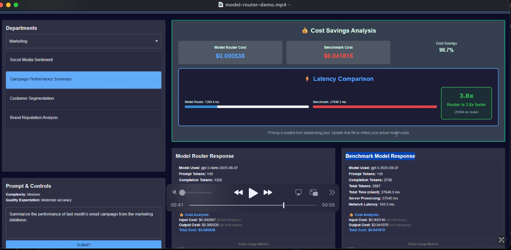
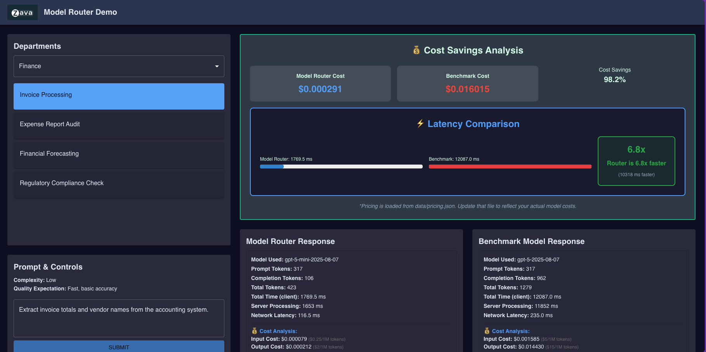

<div>
  <p align="center">
  
  </p>
  <div align="center" style="position: relative; margin-top: -80px; z-index: 1;">
  <h1 style="color: white; text-shadow: 1px 1px 2px rgba(0,0,0,0.8); font-size: 2.1em; margin: 0;">Zava Model Router Demo</h1>
  </div>
</div>

## Table of Contents
- [1. About Zava](#1-about-zava)
- [2. Quick Start (Recommended)](#2-quick-start-recommended)
- [3. Manual Setup (Alternative)](#3-manual-setup-alternative)
  - [3.1 Prerequisites](#31-prerequisites)
  - [3.2 Model Configuration](#32-model-configuration)
  - [3.3 Pricing Configuration](#33-pricing-configuration)
  - [3.4 Install Dependencies](#34-install-dependencies)
  - [3.5 Run the Application](#35-run-the-application)
  - [3.6 Access the Application](#36-access-the-application)
- [4. Project Architecture](#4-project-architecture)
  - [4.1 Technical Details](#41-technical-details)
  - [4.2 Data Structure for RAG](#42-data-structure-for-rag)
- [5. Key Features](#5-key-features)
  - [5.1 Model Routing](#51-model-routing)
  - [5.2 Side-by-Side Model Comparison](#52-side-by-side-model-comparison)
  - [5.3 Cost Analysis and ROI Demonstration](#53-cost-analysis-and-roi-demonstration)
  - [5.4 Retrieval-Augmented Generation (RAG)](#54-retrieval-augmented-generation-rag)
- [6. Development and Customization](#6-development-and-customization)
  - [6.1 Modifying Scenarios](#61-modifying-scenarios)
  - [6.2 Updating Pricing Configuration](#62-updating-pricing-configuration)
  - [6.3 Frontend Development](#63-frontend-development)
  - [6.4 Backend Development](#64-backend-development)
- [7. Troubleshooting](#7-troubleshooting)
  - [7.1 Script and Setup Issues](#71-script-and-setup-issues)
  - [7.2 Runtime Issues](#72-runtime-issues)
  - [7.3 Azure OpenAI Issues](#73-azure-openai-issues)
  - [7.4 Data and RAG Issues](#74-data-and-rag-issues)
  - [7.5 Browser Issues](#75-browser-issues)
  - [7.6 Application Modes](#76-application-modes)
- [8. Demo Test Run](#8-demo-test-run)
  - [8.1 Mock Demo](#81-mock-demo)
  - [8.2 Live Demo](#82-live-demo)

<div style="width: 100%; height: 4px; background: linear-gradient(90deg, #1e3a8a 0%, #0d9488 50%, #06b6d4 100%); margin: 2rem 0; border-radius: 2px;"></div>


## 1. About Zava

Zava is an enteprise retailer of home improvement goods for DIY enthusiasts. Their App Development team is currently building an AI chatbot solution that can be used by store managers to query their internal data (e.g., inventory status, marketing plans, financial reports etc.)

This demo shows how the _Model Router_ can simplify their AI application design and optimize their deployment cost, performance, and accuracy - by making intelligent model choice decisions in real time, based on the user input (prompt).

<br/>

## 2. Quick Start (Recommended)

This method uses a PowerShell script to automate the entire setup and launch process.

1.  **Configure Credentials (for Live Mode):**
    - In the project root, copy the `.env.example` file and rename it to `.env`.
    - Open the new `.env` file and fill in your Azure OpenAI credentials.
    - If you skip this, the app will run in Mock Mode.

2.  **Run the Startup Script:**
    - Open a PowerShell terminal in the project root directory.
    - Execute the script:
      ```powershell
      .\start-demo.ps1
      ```
    - The script will install all dependencies and launch the frontend and backend servers in new terminal windows.

3.  **Access the Application:**
    - Open your web browser and navigate to `http://localhost:5173`.


<br/>

## 3. Manual Setup (Alternative)

Follow these steps if you are not using PowerShell or prefer to run each component manually.

### 3.1 Prerequisites

Ensure you have the following installed:
- **Python** (Version 3.10 or newer)
- **Node.js** (Version 18.x or newer) and **npm**

### 3.2 Model Configuration

1. Create an Azure AI Foundry Project
    - Visit https://ai.azure.com and log in
    - Click "Create New Project" and complete workflow
1. Deploy two models 
    - the primary model = `model-router` - the primary model
    - the benchmark model = `gpt-5` or `gpt-4.1`
1. Configure environment variables 
    - copy `.env.example` to `.env` 
    - update values as shown
      ```bash
      # Model Router Credentials (Primary)
      AZURE_OPENAI_ENDPOINT="https://your-resource.openai.azure.com/"
      AZURE_OPENAI_API_KEY="your-api-key-here"
      AZURE_OPENAI_API_VERSION="2024-05-01-preview"
      AZURE_OPENAI_DEPLOYMENT_NAME="your-deployment-name"

      # Benchmark Model Credentials (for comparison)
      AZURE_OPENAI_BENCHMARK_ENDPOINT="https://your-benchmark-resource.openai.azure.com/"
      AZURE_OPENAI_BENCHMARK_API_KEY="your-benchmark-api-key"
      AZURE_OPENAI_BENCHMARK_API_VERSION="2024-05-01-preview"
      AZURE_OPENAI_BENCHMARK_DEPLOYMENT_NAME="your-benchmark-deployment-name"
      ```
> [!IMPORTANT]  
> - If primary credentials are blank, the app will run in Mock Mode with simulated responses.
> - Benchmark credentials are optional - if not provided, mock benchmark responses are shown.
> For best results, use a high-quality model like GPT-4 or GPT-5 **for the benchmark**

### 3.3 Pricing Configuration

The `src/` folder contains a `data/pricing.json` file that provides synthetic pricing configuration  data for the cost calculations and ROI demonstrations.

**Key Benefits:**
- ✅ **No Code Changes Required**: Update pricing anytime by editing `data/pricing.json`
- ✅ **Automatic Loading**: Pricing updates take effect on browser refresh
- ✅ **Real-time Cost Calculations**: All cost displays use current pricing data
- ✅ **ROI Demonstrations**: Side-by-side cost comparison shows Model Router savings

This is what the default data looks like. 

```json
# Edit data/pricing.json to update model pricing
{
  "pricing_info": {
    "description": "Model pricing configuration per 1M tokens (input/output)",
    "last_updated": "2025-09-16",
    "currency": "USD"
  },
  "models": {
    "model-router": {
      "input_per_1m": 0.00,
      "output_per_1m": 0.00,
      "description": "Model Router - showcases cost savings"
    },
    "gpt-5": {
      "input_per_1m": 1.25,
      "output_per_1m": 10.00,
      "description": "Premium model pricing"
    },
    "default": {
      "input_per_1m": 5.00,
      "output_per_1m": 15.00,
      "description": "Default fallback pricing"
    }
  }
}
```
To update pricing:
1. Edit `data/pricing.json` with your current model rates
2. Add new model types as needed under the "models" section
3. Refresh the browser - changes load automatically
4. No server restart required for pricing updates

### 3.4 Install Dependencies

- **Backend:**
  ```bash
  # Create and activate a Python virtual environment
  python -m venv .venv
  # On Windows (pwsh):
  .venv\Scripts\Activate.ps1
  # On macOS/Linux:
  source .venv/bin/activate

  # Install Python packages
  pip install -r requirements.txt
  ```

- **Frontend:**
  ```bash
  npm install
  ```

### 3.5 Run the Application

You will need two separate terminals.

- **Terminal 1: Start the Backend**
  ```bash
  # Make sure your Python virtual environment is activated
  python app.py
  ```

- **Terminal 2: Start the Frontend**
  ```bash
  npm run dev
  ```

### 3.6 Access the Application

- Open your browser to `http://localhost:5173`.


<br/>

## 4. Project Architecture

### 4.1 Technical Details

For detailed technical architecture, component breakdowns, and development patterns, see [source-map.md](source-map.md).

```
src/
├── /data/                          # Demo data and scenarios
│   ├── scenarios.json              # Demo scenarios, prompts, and metadata
│   └── /scenario_source_data/      # RAG data files organized by department
│       ├── /finance/               # Financial data files (CSV, JSON, TXT)
│       ├── /marketing/             # Marketing data files (CSV, JSON)
│       └── /development/           # Product development data (JSON, MD)
├── /public/                        # Static assets
│   └── zava-logo.png               # Zava logo image
├── /src/                           # React frontend source code
│   ├── App.jsx                     # Main UI component
│   ├── main.jsx                    # React entry point
│   └── index.css                   # Global styles
├── .env.example                    # Environment variables template
├── /dist/                          # Compiled frontend assets (auto-generated)
├── app.py                          # Flask backend server
├── index.html                      # Main HTML template
├── package-lock.json               # NPM lockfile for dependency management
├── package.json                    # Frontend dependencies and scripts
├── README.md                       # This file - with demo documentation
├── requirements.txt                # Python dependencies
├── source-map.md                   # Project structure documentation
├── start-demo.ps1                  # Automated startup script (Windows)
├── vite.config.js                  # Vite build configuration
├── .gitignore                      # Git ignore rules
```

### 4.2 Data Structure for RAG

The `/data/scenario_source_data/` directory contains sample data files that demonstrate the RAG pattern:

- **Finance Department**: `invoice_data.json`, `expense_reports.json`, `historical_sales.csv`, `sec_filing_snippet.txt`
- **Marketing Department**: `social_media_mentions.json`, `campaign_performance.csv`, `customer_data.csv`, `brand_reputation_forums.json`  
- **Development Department**: `bug_reports.json`, `feature_requests.json`, `product_launch_notes.md`, `competitive_analysis.md`

Each scenario in `scenarios.json` includes a `source_data_file` field that references one of these files.

<br/>

## 5. Key Features

### 5.1 Model Routing
The backend (`app.py`) is responsible for receiving prompts and routing them. In Live Mode, it forwards the request to the configured Azure Model Router. In Mock Mode, it uses a simple keyword-based logic to simulate routing to different model tiers.

### 5.2 Side-by-Side Model Comparison
The application now features a **dual-response comparison mode** that addresses customer concerns about model router quality versus premium models:

- **Model Router Response**: Shows the result from the intelligent routing system, demonstrating cost-effective model selection
- **Benchmark Model Response**: Shows the result from a premium model (e.g., GPT-4/GPT-5) for direct quality comparison
- **Visual Comparison**: Side-by-side layout with token usage metrics and response quality analysis
- **Value Demonstration**: Helps showcase cost savings while maintaining comparable quality

The comparison uses two separate API endpoints:
- `/api/route-comparison` - Returns both router and benchmark responses
- `/api/route` - Returns single router response (legacy endpoint)

### 5.3 Cost Analysis and ROI Demonstration
The application includes comprehensive cost analysis features designed to demonstrate the financial benefits of using Model Router:

- **Per-Model Cost Display**: Each response panel shows detailed token usage and cost breakdown
- **Real-time Pricing**: Costs calculated using current rates from `data/pricing.json`
- **Side-by-Side Cost Comparison**: Direct cost comparison between Model Router and benchmark models
- **Savings Percentage**: Automatic calculation and display of cost savings percentage
- **Configurable Pricing**: Easy pricing updates without code changes for accurate ROI demonstrations

**Cost Analysis Features:**
- Input token cost breakdown (per 1M tokens)
- Output token cost breakdown (per 1M tokens)
- Total cost per request
- Percentage savings compared to premium models
- Visual cost comparison charts and summaries

### 5.4 Retrieval-Augmented Generation (RAG)
The frontend (`src/App.jsx`) implements a RAG pattern. When a scenario is selected, the application:
1.  Identifies the associated data file from `scenarios.json`.
2.  Fetches the content of that file from the `/data/scenario_source_data` directory.
3.  Appends the fetched data to the user's prompt before sending it to the backend.
This ensures the model has the necessary context to generate a relevant response.

<br/>

## 6. Development and Customization

### 6.1 Modifying Scenarios
To add or modify demo scenarios:
1. Edit `/data/scenarios.json` to add new scenarios or update existing prompts.
2. Create corresponding data files in `/data/scenario_source_data/[department]/` if needed.
3. **Important:** Restart the backend server (`python app.py`) as it loads `scenarios.json` into memory at startup.

### 6.2 Updating Pricing Configuration
To update model pricing for accurate cost demonstrations:
1. **Edit Pricing File**: Modify `/data/pricing.json` with current model rates
2. **Add New Models**: Add new model types under the "models" section as needed
3. **Update Metadata**: Modify "last_updated" date and add descriptions for clarity
4. **No Restart Required**: Simply refresh the browser - pricing loads automatically
6. **Pricing Update Best Practices:**
    - Keep pricing current with market rates for accurate ROI demos
    - Use consistent decimal formatting (e.g., 1.25 not 1.25000)
    - Include descriptive model names that match your deployment names
    - Update the "last_updated" field when making changes
    
  **Example: Adding a New Model**

  ```json
  "models": {
    "your-new-model": {
      "input_per_1m": 3.00,
      "output_per_1m": 9.00, 
      "description": "Your custom model description"
    }
  }
  ```

### 6.3 Frontend Development
- The React frontend supports hot-reloading via `npm run dev`.
- Main UI logic is in `/src/App.jsx`.
- Global styles are in `/src/index.css`.

### 6.4 Backend Development
- The Flask server in `app.py` handles API routing and serves static files.
- Changes to `app.py` require a restart to take effect.
- The server runs on `http://localhost:5000` by default.

### Adding New Data Files
1. Place your data file in the appropriate department folder under `/data/scenario_source_data/`.
2. Update corresponding scenario in `scenarios.json` to reference new file in `source_data_file` field.
3. Restart the backend to reload scenarios.

## 7. Troubleshooting

### 7.1 Script and Setup Issues
- **`start-demo.ps1` fails:** Ensure you are running the script from a PowerShell terminal. If you see an error about script execution being disabled, run `Set-ExecutionPolicy -Scope Process -ExecutionPolicy Bypass` first.
- **Python virtual environment issues:** If `python -m venv .venv` fails, try `python3 -m venv .venv` or ensure Python 3.10+ is installed.
- **Node.js dependency issues:** If `npm install` fails, try deleting `node_modules` and `package-lock.json`, then run `npm install` again.

### 7.2 Runtime Issues
- **UI Not Updating After Code Changes:** 
  - Frontend changes: The `npm run dev` server supports hot-reloading automatically.
  - Backend/data changes: If you change `scenarios.json` or `app.py`, you must **restart the backend** (`python app.py`) for changes to take effect.
- **404 Errors or Blank Page:** Ensure both frontend and backend servers are running. Check that you can access `http://localhost:5000` (backend) and `http://localhost:5173` (frontend).
- **Port conflicts:** 
  - If port 5000 is in use, modify the port in `app.py`: change `app.run(debug=True, port=5000)` to a different port.
  - If port 5173 is in use, Vite will automatically suggest an alternative port.

### 7.3 Azure OpenAI Issues
- **"Azure credentials not configured" message:** Check that your `.env` file exists and contains valid credentials.
- **Connection errors:** Verify your `AZURE_OPENAI_ENDPOINT` format includes `https://` and ends with `/`.
- **Authentication errors:** Double-check your `AZURE_OPENAI_API_KEY` and ensure the deployment name matches exactly.

### 7.4 Data and RAG Issues
- **Missing data file errors:** Check that the file path in `scenarios.json` `source_data_file` field matches an actual file in `/data/scenario_source_data/`.
- **Empty responses:** Verify that your data files contain valid content and are not corrupted.

### 7.5 Browser Issues
- **Cached content:** Try a hard refresh (`Ctrl+Shift+R` on Windows/Linux, `Cmd+Shift+R` on Mac) to clear browser cache.
- **CORS errors:** These shouldn't occur with the current setup, but if you see them, ensure both servers are running on their expected ports.pplication is a full-stack web demo that showcases a dynamic AI model routing system. It consists of:
- A **Python Flask backend** that serves the user interface and provides an API for routing prompts.
- A **React.js frontend** built with Vite that provides an interactive user interface for sending prompts and viewing results.

### 7.6 Application Modes
1.  **Live Mode:** Connects to Azure OpenAI endpoint to route prompts. Displays real results.
2.  **Mock Mode:** Falls back to mock backend if no Azure credentials. Simulates routing logic.

The mock option is good for situations when you are offline or unable to access Azure.

## 8. Demo Test Run

The Zava model router demo can be seen in [this recording](./../docs/assets/model-router-demo.mp4) (screenshot below) - and shows the demo working with live model router and benchmark deplyoments. Let's try running the demo now. 





The repository has a `devcontainer.json` with all the necessary dependencies defined. Simply launch the repo in GitHub Codespaces and wait till you have an active VS Code prompt. Then complete these steps:

1. Open a new VS Code terminal - change to `src/` folder.
    ```bash
    cd src/
    ```
1. Split the terminal to get two side-by-side terminals. In the next section, we'll launch the application frontend and backend instances in each.

### 8.1 Mock Demo 

This is the default version run if you don't have an `.env` specified with your Azure OpenAI configuration. It uses synthetic data to just give the audience an intuitive sense for the real demo - showing them the prompts that could be run, the choices made based on that prompt, and the cost & latency implications of that choice.

To run the demo:

1. In the left hand side terminal, type this command to start the Flashk app (backend):
    ```bash
    python app.py 
    ```

1. In the right hand side terminal, type this command to start the React web app (frontend):
    ```bash
    npm install
    npm run dev
    ```
1. You should see a front-end UI (like the screenshot) pop-up with blank tiles.
1. Now try a demo
    - Pick a department from the dropdown
    - Pick a task in that department
    - Click the `SUBMIT` button to mimic prompt input
    - The router and benchmark panels will populate as shown

Explore the panels and see how the UI visualizes the latency and cost implications of the model choice - highlighting how a _lightweight_ model can deliver a speedup and cost savings in response **without any user effort** in model selection or configuration.


### 8.2 Live Demo 

Now you need an `.env` with the relevant model deployment configuration.

1. Copy the `src/.env.sample` file to `src/.env`
1. Update the `.env` file with the endpoints for two models
1. For the primary model - fill `model-router` deployment details
1. For the benchmark model - fill `gpt-4.1` or `gpt-5` details
1. Run the backend and frontend apps again, as before
1. Select a new prompt and submit it.

You see something like this after a few seconds of processing (spinning wheel). Note how we selected `gpt-5` as a benchmark, but the model-router was able to use `gpt-5.1-mini` for a **6.8X** speedup in response time, and a **98%** reduction in costs.



## Troubleshooting

The current Flask code looks for the `dist` directory for the built frontend app. To get that ready, run this set of commands. Then restart the Python backend.

```bash
cd src/
npm install
npm run build
```

